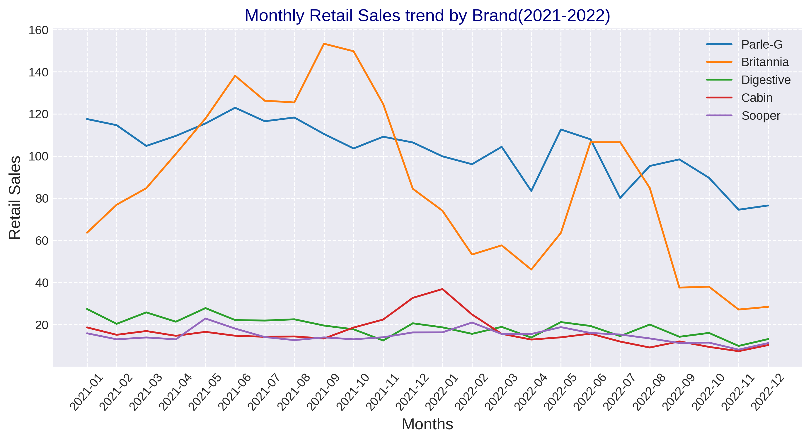

# Sales-Analysis-Project
This project analyzes the monthly retail and wholesale sales of fast-moving consumer goods (FMCG) brands like Parle-G, Britannia, Morning Coffee and so on across various regions and territories. Using Python, Pandas, and Matplotlib, it visualizes sales patterns and extracts real-world business insights from over 85,000 rows of data.

   What I Did:
 -First I imported all needed libraries and did data cleaning work by checking null values then removed duplicate entiries.
 -Created a new feature, "year_month, to aggregate sales by month using datetime format.
 -I filtered the dataset by brand when necessary to focus on specific product trends, following the analysis questions step-by-step
 -I created clear and informative line plots with customized labels, markers, and rotated x-axis ticks for better readability.Also created bar graph,heatmap to increase versatility in my project.
 -Extracted business insights based on observed sales patterns.

   Key Insights:
 - Sales fluctuations across brands and regions suggest varying customer preferences and marketing effectiveness.
- The analysis highlighted opportunities for brands to optimize inventory and marketing strategies based on sales cycles.
- This project strengthened my skills in converting raw data into actionable business insights.

    Tools & Technologies Used
- Python (Pandas, Matplotlib)
-  Google Colab
- Data cleaning, filtering, grouping, and aggregation
- Line chart,bar graph,heatmap

  Demo of my project:

  
